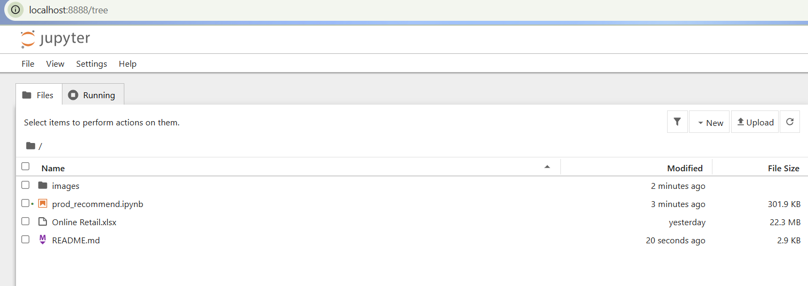

# Product Recommendation System

This repository contains the code for a simple product recommendation system built using Python, focusing on Item-Item Collaborative Filtering.

## Environment Setup

To set up the development environment, **Miniconda** is recommended due to its lightweight nature and robust package management capabilities.

**Follow these steps to set up your environment:**

1.  **Download Miniconda:**
    * Visit the official Miniconda distribution page: [https://docs.conda.io/en/latest/miniconda.html](https://docs.conda.io/en/latest/miniconda.html)
    * Download the appropriate **64-bit Graphical Installer** for your operating system (Windows, macOS, or Linux).

2.  **Install Miniconda:**
    * Run the downloaded installer.
    * During the installation process, **ensure you select the option to "Add Miniconda3 to my PATH environment variable"**. This is crucial for running `conda` commands from any terminal.

3.  **Open Anaconda Prompt/Terminal:**
    * **Windows:** Search for "Anaconda Prompt" in your Start Menu and open it.
    * **macOS/Linux:** Open your standard Terminal application.

4.  **Create a dedicated Virtual Environment:**
    * Create a new Conda virtual environment for this project (e.g., `my_ds_project_env`) with Python:
        ```bash
        conda create -n my_ds_project_env
        ```
    * When prompted to proceed, type `y` and press `Enter`.

5.  **Activate the Environment:**
    * Activate the newly created environment:
        ```bash
        conda activate my_project_env
        ```
    * You should see the environment name `(my_project_env)` appear at the beginning of your terminal prompt, indicating it's active.

6.  **Install Required Libraries:**
    * Install all necessary Python libraries within the activated environment:
        ```bash
        conda install pandas numpy scikit-learn matplotlib seaborn jupyter openpyxl
        ```
    * When prompted to proceed, type `y` and press `Enter`. This step may take a few minutes.

7.  **Navigate to the Project Directory:**
    * Change your current directory to the folder where you have saved your project files (including `Online Retail.xlsx`):
        ```bash
        cd C:\Path\To\Your\Project\Folder
        ```
        *(**Note:** Replace `C:\Path\To\Your\Project\Folder` with the actual path to your project directory. For macOS/Linux, paths might look like `/Users/YourUsername/Documents/MyProject`)*

8.  **Launch Jupyter Notebook:**
    * From your project directory in the activated terminal, launch Jupyter Notebook:
        ```bash
        jupyter notebook
        ```
    * This command will open the Jupyter Notebook interface in your default web browser, from where you can open and run the project's `.ipynb` file.

    **Jupyter Notebook Web Interface:**

    

---
